# README

## 授权说明

本书采用[CC-BY-NC-SA协议](https://creativecommons.org/licenses/by-nc-sa/4.0/deed.zh-hans)发布。

- 您可以复制、发行、展览、表演、放映、广播或通过信息网络传播本作品，但必须署名作者并添加链接到[本书GitHub仓库](https://github.com/chemtour/chemtour)。
- 不得为商业目的而使用本作品。
- 仅在遵守与本作品相同的许可条款下，您才能散布由本作品产生的派生作品。
- 本库引入mermaid.js可以实现mdbook中轻松插入流程图，详见下面示例。
- 本库支持中文全文本检索。

## 化工知识库

对本知识库感兴趣的朋友，欢迎提出您的宝贵建议：

## mermaid示例

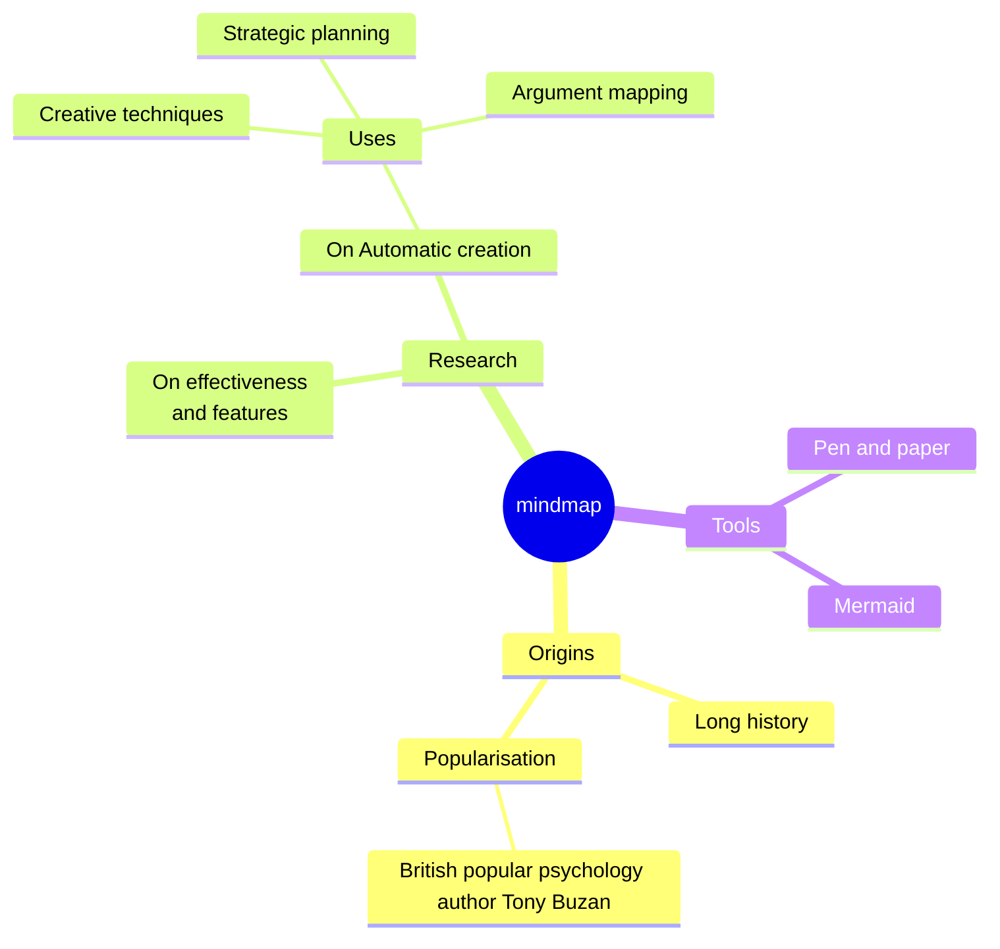

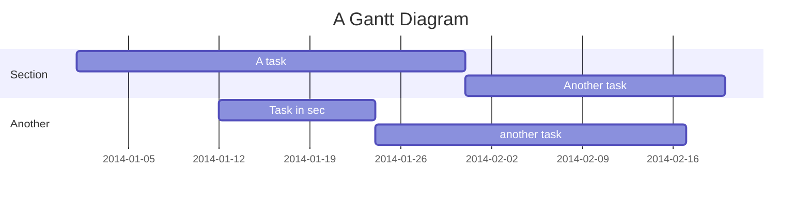

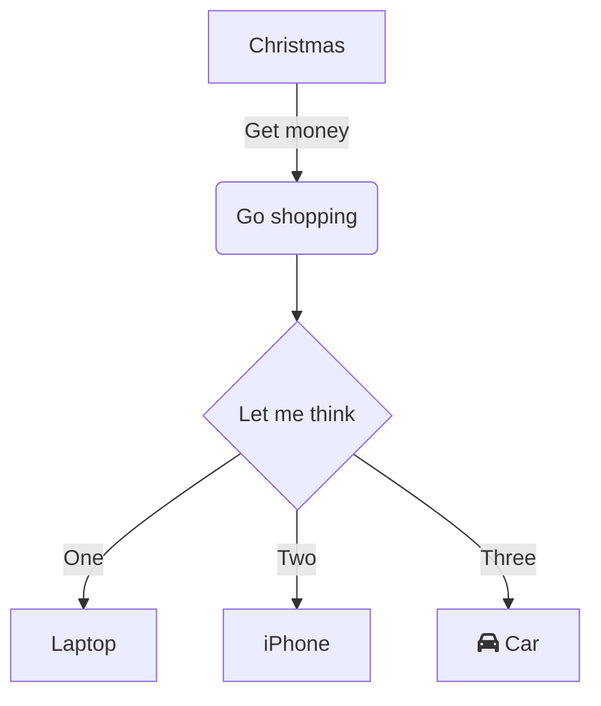
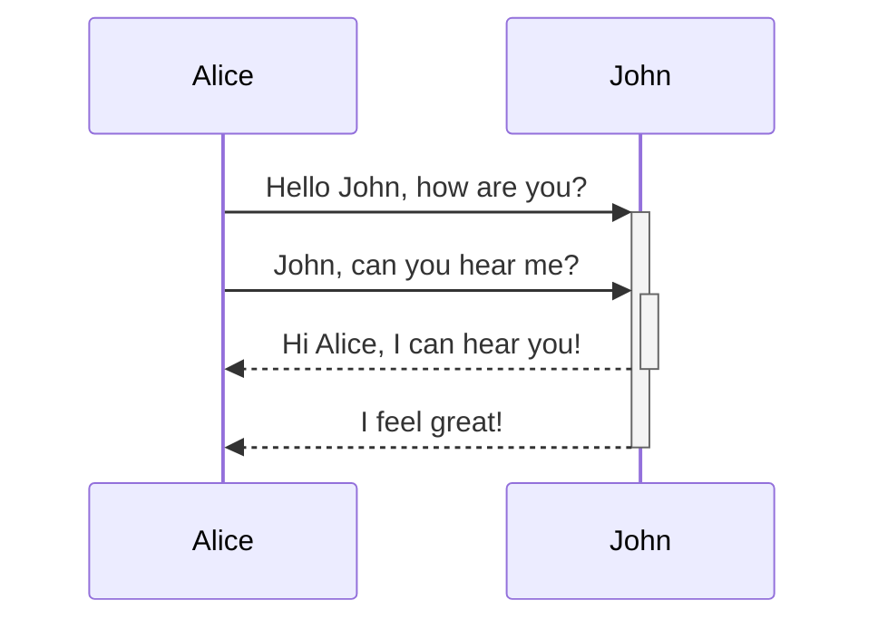

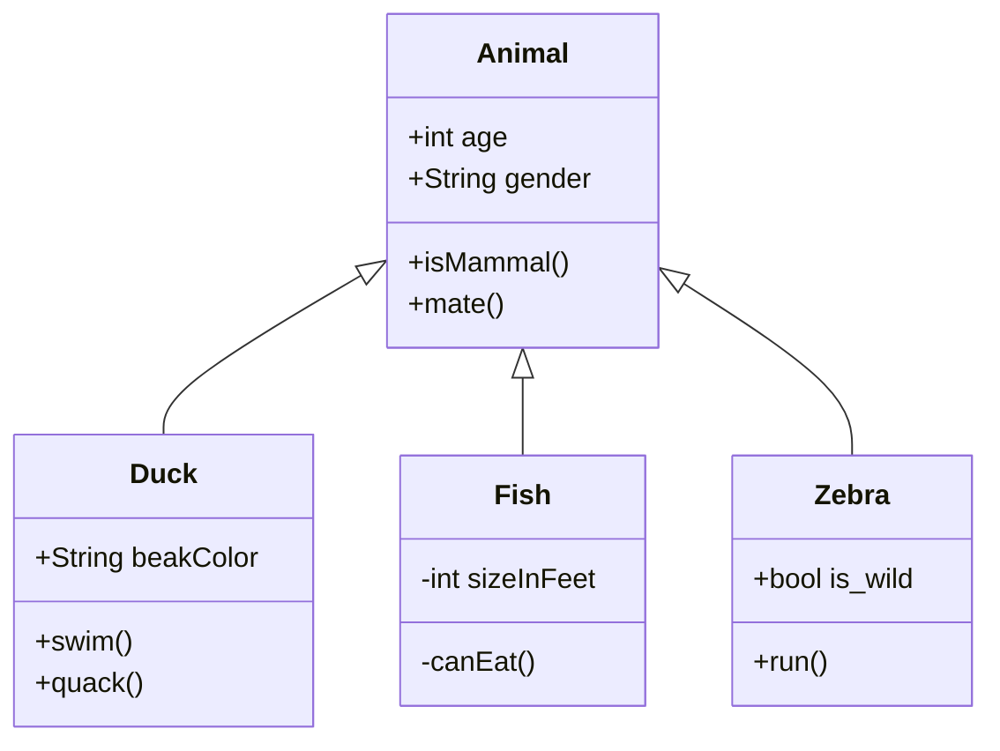

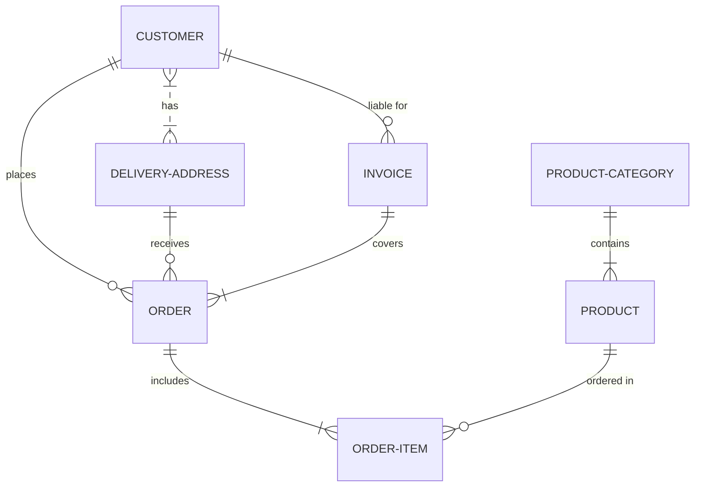

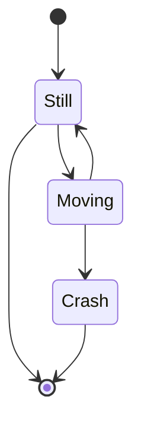

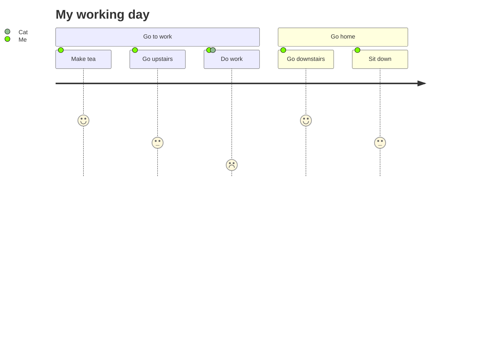

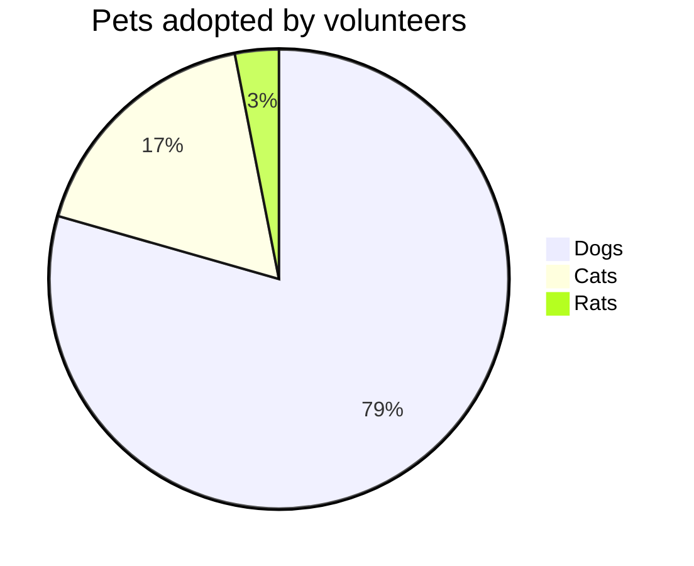

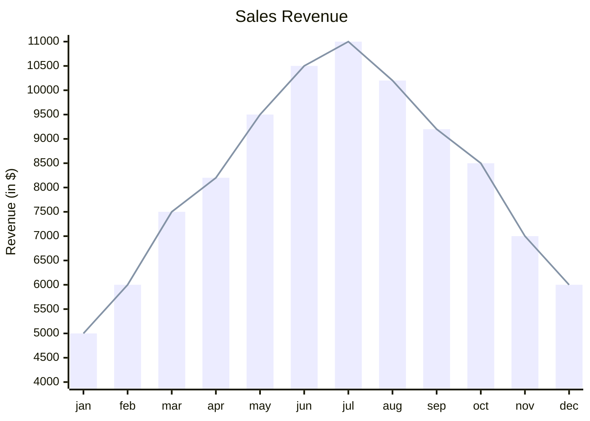

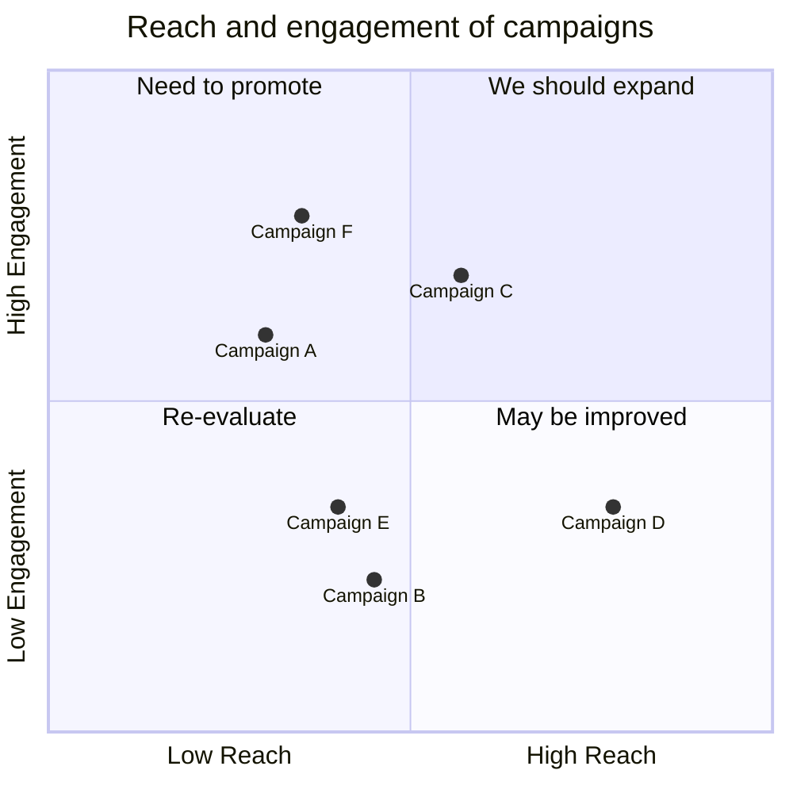

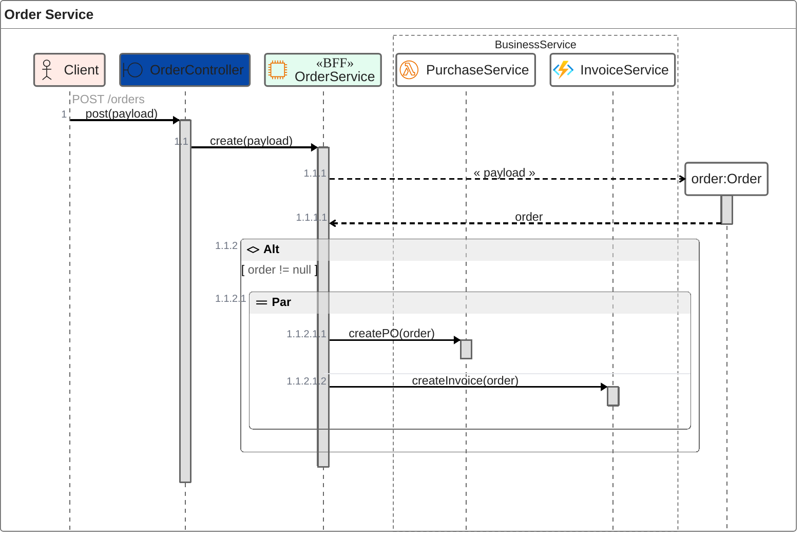

