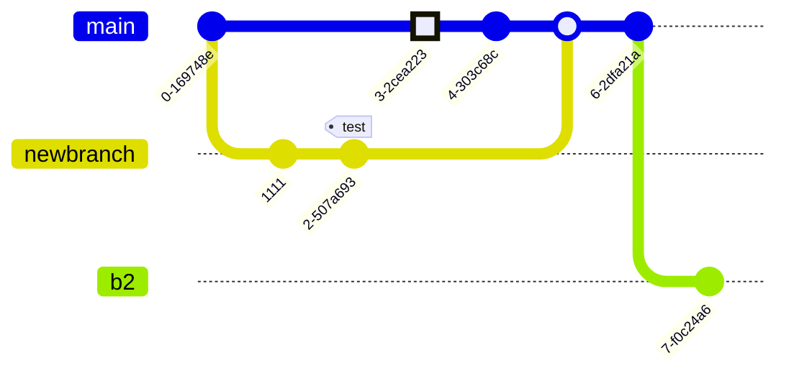

# README

## 授权说明

本书采用[CC-BY-NC-SA协议](https://creativecommons.org/licenses/by-nc-sa/4.0/deed.zh-hans)发布。

- 您可以复制、发行、展览、表演、放映、广播或通过信息网络传播本作品，但必须署名作者并添加链接到[本书GitHub仓库](https://github.com/chemtour/chemtour)。
- 不得为商业目的而使用本作品。
- 仅在遵守与本作品相同的许可条款下，您才能散布由本作品产生的派生作品。
- 本库引入mermaid.js可以实现mdbook中轻松插入流程图，详见下面示例。
- 本库支持中文全文本检索。

## 化工知识库


对本知识库感兴趣的朋友，欢迎提出您的宝贵建议：
<script src="https://utteranc.es/client.js"
        repo="chemtour/chemtour"
        issue-term="chemtour-index-issues"
        label="⭐Star"
        theme="github-light"
        crossorigin="anonymous"
        async>
</script>


## katex示例
详细的语法浏览[katex文档](https://katex.org/docs/supported.html)
源文件github [mdbook-katex库](https://github.com/lzanini/mdbook-katex?tab=readme-ov-file)
Here is an inline example, $ \pi(\theta) $,

an equation,

$$ \nabla f(x) \in \mathbb{R}^n, $$

and a regular \$ symbol.

$$ \mathrm{CO_{2} } + \mathrm{H_{2}}  \longrightarrow   \mathrm{CO} +\mathrm{H_{2} O} $$

$$ \ce{SO4^2- + Ba^2+ -> BaSO4 v} $$

## mermaid示例
详细的语法浏览[mermaid中文网](https://mermaid.nodejs.cn/)





```mermaid
    requirementDiagram

    requirement test_req {
    id: 1
    text: the test text.
    risk: high
    verifymethod: test
    }

    functionalRequirement test_req2 {
    id: 1.1
    text: the second test text.
    risk: low
    verifymethod: inspection
    }

    performanceRequirement test_req3 {
    id: 1.2
    text: the third test text.
    risk: medium
    verifymethod: demonstration
    }

    interfaceRequirement test_req4 {
    id: 1.2.1
    text: the fourth test text.
    risk: medium
    verifymethod: analysis
    }

    physicalRequirement test_req5 {
    id: 1.2.2
    text: the fifth test text.
    risk: medium
    verifymethod: analysis
    }

    designConstraint test_req6 {
    id: 1.2.3
    text: the sixth test text.
    risk: medium
    verifymethod: analysis
    }

    element test_entity {
    type: simulation
    }

    element test_entity2 {
    type: word doc
    docRef: reqs/test_entity
    }

    element test_entity3 {
    type: "test suite"
    docRef: github.com/all_the_tests
    }


    test_entity - satisfies -> test_req2
    test_req - traces -> test_req2
    test_req - contains -> test_req3
    test_req3 - contains -> test_req4
    test_req4 - derives -> test_req5
    test_req5 - refines -> test_req6
    test_entity3 - verifies -> test_req5
    test_req <- copies - test_entity2
```

```mermaid
gantt
    dateFormat  YYYY-MM-DD
    title       Adding GANTT diagram functionality to mermaid
    excludes    weekends
    %% (`excludes` accepts specific dates in YYYY-MM-DD format, days of the week ("sunday") or "weekends", but not the word "weekdays".)

    section A section
    Completed task            :done,    des1, 2014-01-06,2014-01-08
    Active task               :active,  des2, 2014-01-09, 3d
    Future task               :         des3, after des2, 5d
    Future task2              :         des4, after des3, 5d

    section Critical tasks
    Completed task in the critical line :crit, done, 2014-01-06,24h
    Implement parser and jison          :crit, done, after des1, 2d
    Create tests for parser             :crit, active, 3d
    Future task in critical line        :crit, 5d
    Create tests for renderer           :2d
    Add to mermaid                      :until isadded
    Functionality added                 :milestone, isadded, 2014-01-25, 0d

    section Documentation
    Describe gantt syntax               :active, a1, after des1, 3d
    Add gantt diagram to demo page      :after a1  , 20h
    Add another diagram to demo page    :doc1, after a1  , 48h

    section Last section
    Describe gantt syntax               :after doc1, 3d
    Add gantt diagram to demo page      :20h
    Add another diagram to demo page    :48h
```

```mermaid
erDiagram
    CAR ||--o{ NAMED-DRIVER : allows
    CAR {
        string registrationNumber PK
        string make
        string model
        string[] parts
    }
    PERSON ||--o{ NAMED-DRIVER : is
    PERSON {
        string driversLicense PK "The license #"
        string(99) firstName "Only 99 characters are allowed"
        string lastName
        string phone UK
        int age
    }
    NAMED-DRIVER {
        string carRegistrationNumber PK, FK
        string driverLicence PK, FK
    }
    MANUFACTURER only one to zero or more CAR : makes
```